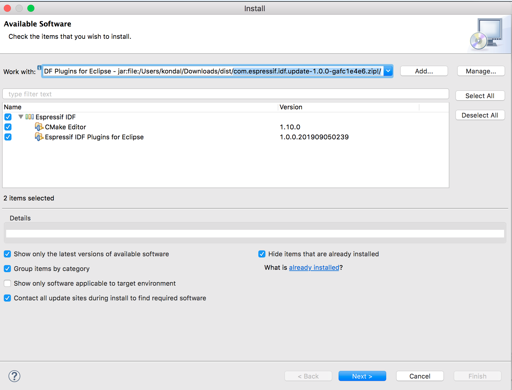
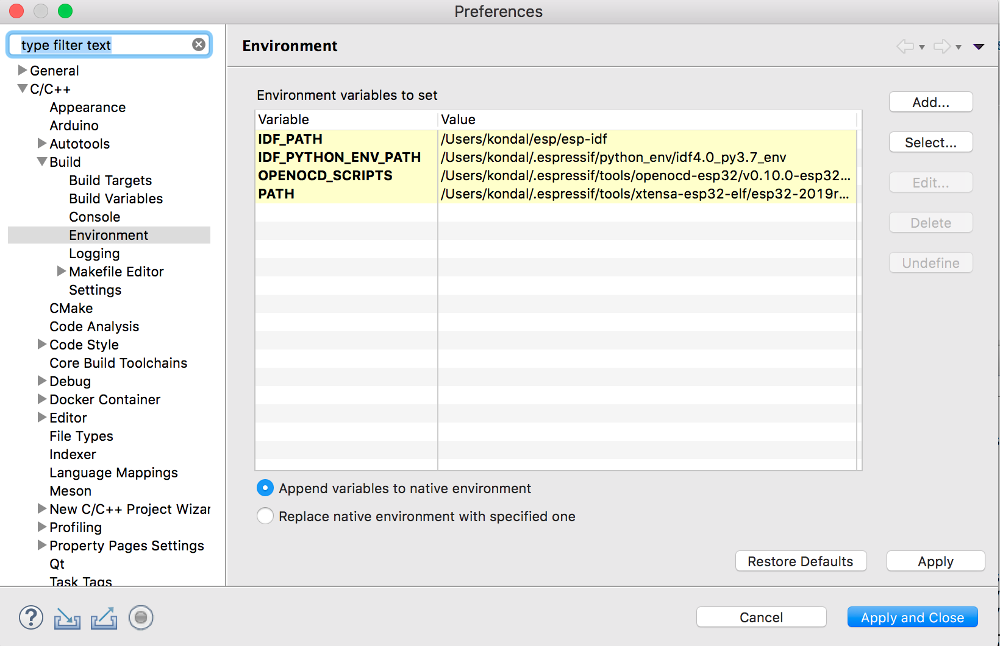
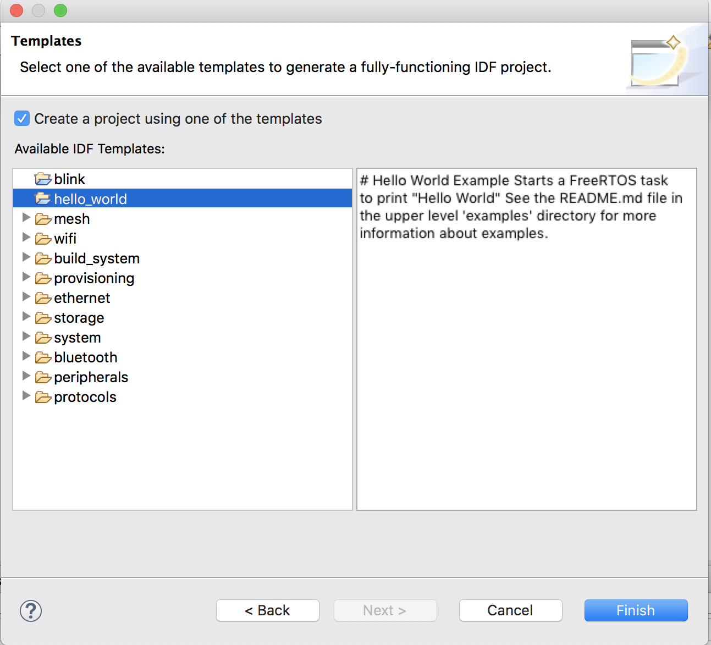
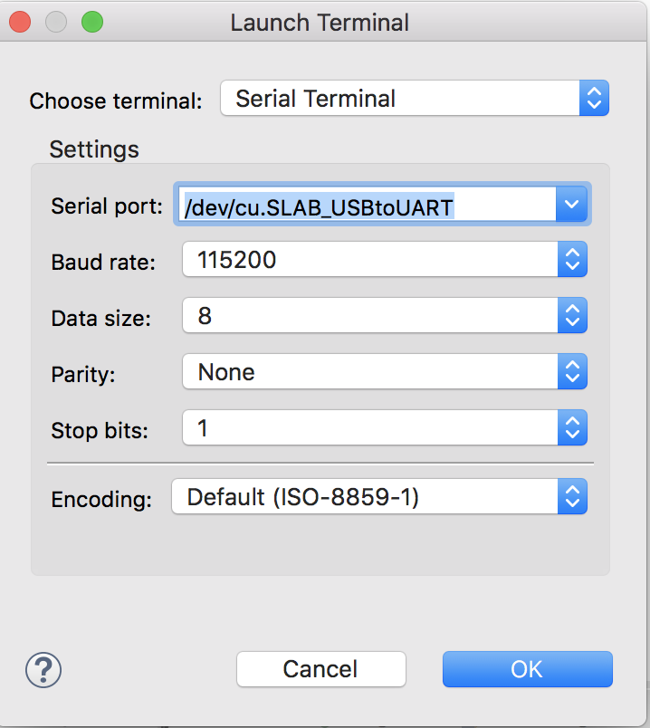

# idf-eclipse-plugin

Eclipse Plugins for Espressif IoT Development Framework(IDF)

# Prerequisites
* **Java 8 and Higher** : Download and install Java SE 11 from here https://www.oracle.com/technetwork/java/javase/downloads/index.html
* **Eclipse 2018-12 CDT Package** : Download and install Eclipse CDT package from here. https://www.eclipse.org/downloads/packages/release/2018-12/r/eclipse-ide-cc-developers

# Getting started with the Eclipse IDF Plugins:

* Download the Espressif IDF eclipse `artifacts.zip` file from https://gitlab.espressif.cn:6688/idf/idf-eclipse-plugin/-/jobs/artifacts/master/download?job=build
* Extract the downloaded zip file
* Launch Eclipse
* Go to `Help` -> `Install New Software`
* Click `Add…` button
* Select `Archive` from Add repository dialog and select the file ``com.espressif.idf.update-1.0.0-SNAPSHOT.zip`` from the extracted folder
* Click `Add`
* Select `Espressif IDF` from the list and proceed with the installation 
* Restart the Eclipse

# Configuring Environment Variables:
* Click on the `Environment` preference page under `C/C++ Build`. 
* Click “Add…” and enter name `BATCH_BUILD` and value `1`.
* Click “Add…” again, and enter name `IDF_PATH`. The value should be the full path where ESP-IDF is installed. Windows users can copy the IDF_PATH from windows explorer.
* Edit the `PATH` environment variable. Keep the current value, and append the path to the Xtensa toolchain installed as part of IDF setup, if this is not already listed on the PATH. A typical path to the toolchain looks like `/home/user-name/esp/xtensa-esp32-elf/bin`. Note that you need to add a colon : before the appended path. Windows users will need to prepend `C:\msys32\mingw32\bin;C:\msys32\opt\xtensa-esp32-elf\bin;C:\msys32\usr\bin` to PATH environment variable (If you installed msys32 to a different directory then you’ll need to change these paths to match).

# CMake IDF Project

## To create a new Project using default esp-idf-template:
* Make sure you are in C/C++ perspective.
* Go to `File` > `New` > `Espressif IDF Project` (If you don't see this, please reset the perspective from `Window` > `Perspective` > `Reset Perspective..`)
* Provide the project Name
* Click `Finish`

## To create a new project using idf examples/templates:
* Make sure you're in C/C++ perspective.
* Go to `File` > `New` > `Espressif IDF Project` (If you don't see this, please reset the perspective from `Window` > `Perspective` > `Reset Perspective..`)
* Provide the Project Name
* Click `Next`
* Check `Create a project using one of the templates`
* Select the required template from the tree
* Click `Finish`

##  Import an existing IDF Project
* Make sure you're in `C/C++ Perspective`.
* Right click on the Project Explorer
* Select `Import..` Menu
* Select `Existing IDF Project` from `Espressif` import wizard menu list
* Click `Next`
* Click on `Browse...` to choose an existing project location directory
* Provide project name if you wish you have a different name
* Click `Finish` to import the selected project into eclipse workspace as a CMake project

# Building the IDF projects

## Configuring Core Build Toolchains

* Open Eclipse Preferences
* Navigate to `C/C++  -> “Core Build Toolchains` preference page
* Click on `Add..` from the User defined Toolchians tables
* Select `GCC` as a toolchain type
* Click on `Next>`
* Provide the GCC Toolchain Settings:

**Compiler:** /Users/kondal/esp/xtensa-esp32-elf/bin/xtensa-esp32-elf-gcc,
**Operating System:** esp32,
**CPU Architecture:** xtensa

## Configuring CMake Toolchain
We now need to tell CDT which toolchain to use when building the project. This will pass the required arguments to CMake when generating the Ninja files.

* Navigate to “C/C++  -> “CMake” preference page
* Click `Add..` and this will launch the New CMake Toolchain configuration dialog
* Browse CMake toolchain `Path`. Example: `/Users/kondal/esp/esp-idf/tools/cmake/toolchain-esp32.cmake`
* Select GCC Xtensa Toolchain compiler from the drop-down list. Example: `esp32 xtensa /Users/kondal/esp/xtensa-esp32-elf/bin/xtensa-esp32-elf-gcc`

**NOTE:**  Eclipse CDT has a bug in saving the toolchain preferences, hence it's recommended to restart the Eclipse before we move further configuring the launch target.

## Configuring Launch target
Next, we need to tell CDT to use the toolchain for our project. This is accomplished through the Launch Bar, the new widget set you see on the far left of the toolbar. And this will be shown only when you have a project in the project explorer.

* Click on the third dropdown 
* Select `New Launch Target`
* Select `ESP32 Target`
* Provide properties for the target where you would like to launch the application. Enter a name for the target, “esp32” as the operating system, “xtensa” as the CPU architecture, and select the serial port your ESP32 device is connected to on your machine. The OS and architecture need to match the settings for the toolchain. You can see those settings in the Preferences by selecting C/C++ and Core Build Toolchains.

## Building the Application
* Select a project from the Project Explorer
* Select `Run` from the first drop-down, which is called `Launch Mode`
* Select your application from the second drop-down, which is called `Launch Configuration`
* Select target from the third drop-down, which is called `Launch Target`
* Now click on the `Build` button widget which you see on the far left of the toolbar

## Configuring the Launch Terminal
To see what program do we need to configure eclipse terminal to connect the serial port.

* Click on the "Open a Terminal" icon from the toolbar
* Choose `Serial Terminal` from the terminal drop-down
* Select `Serial Port` for your board. Example: /dev/cu.SLAB_USBtoUART
* And, configure the remaining settings and click on Ok to launch the eclipse terminal and which will listen the USB port

**NOTE:** This won't display anything immediately until the application is flashed on to the board. 

## Flashing the Application
ESP-IDF has a tool called "idf.py" which is a wrapper around make flash command with some handy operations. Follow the below instructions to hook the idf.py to the launch configuration

* Click on the `Launch Configuration` edit button
* Switch to the `Main` tab
* Specify the `Location` where this application has to run on. Since idf.py is a python file, will configure the python system path. Example:`${system_path:python}`
* Specify `Working directory` of the application. Example: `${workspace_loc:/hello_world}`
* In additional arguments, provide a flashing command which will run in the specified working directory
* Flash command looks like this: `/Users/kondal/esp/esp-idf/tools/idf.py -p /dev/cu.SLAB_USBtoUART flash`
* Click OK to save the settings
* Click on the `Launch` icon to flash the application to the selected board 

**NOTE:** Eclipse CDT Launch configuration has issues in accessing eclipse C/C++ environment variables, hence we need to define `PATH` again in the Launch configuration `Environment` tab to get the access to the CMake command during the build.

## How to raise bugs
Raise issues directly under espressif JIRA here https://jira.espressif.com:8443/projects/IEP/issues/ with the project name `IDF Eclipse Plugin(IEP)`

## FAQ's

1. Which version of Java should I use? 
> Java 8 and higher
2. Which version of Eclipse should I use?
> Eclipse 2019-12 CDT and higher
3. How do I know the installed version of Java in my system?
> You can check using "java -version" command from the terminal
4. Espressif Menu options and Espressif IDF Project menu is not visible in my eclipse
> Make sure you're using Java 11 and in the C/C++ perspective
5. How do I access the error log?
> To view the Eclipse error log: From the main menu, select Window > Show View > Other. Then select General > Error Log.
6. How do I know the installed eclipse IDF plugins version?
> You can check using Eclipse menu > About Eclipse > Installation Details > Installed Software > Search for "espressif"
7. How do I uninstall IDF plugins from the eclipse?
> Eclipse menu > About Eclipse > Installation Details > Installed Software > Search for "espressif" > Select the espressif IDF plugins > Uninstall..
8. Unable to install idf plugins in eclipse?
> Please check the error log from the main menu, select Window > Show View > Other. Then select General > Error Log. 
9. Do IDF plugins support CMake project creation?
> Yes, you can create idf CMake project using File > New > Espressif IDF Project
10. Can I import my existing IDF project into eclipse?
> Yes, you can import using Import Menu. Import... > Espressif > Existing IDF Project
